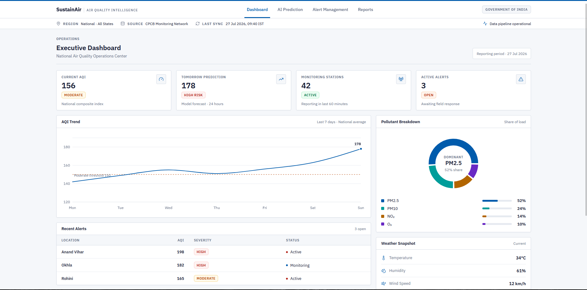
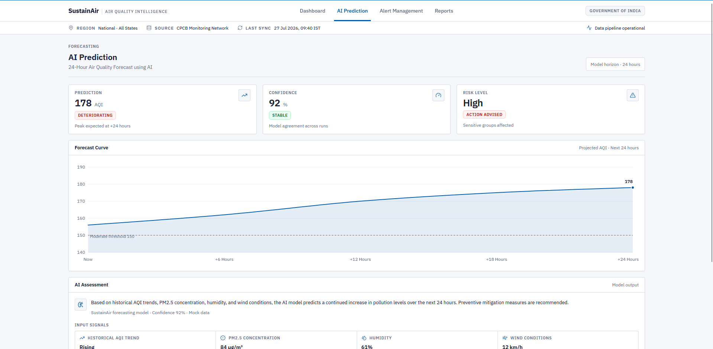
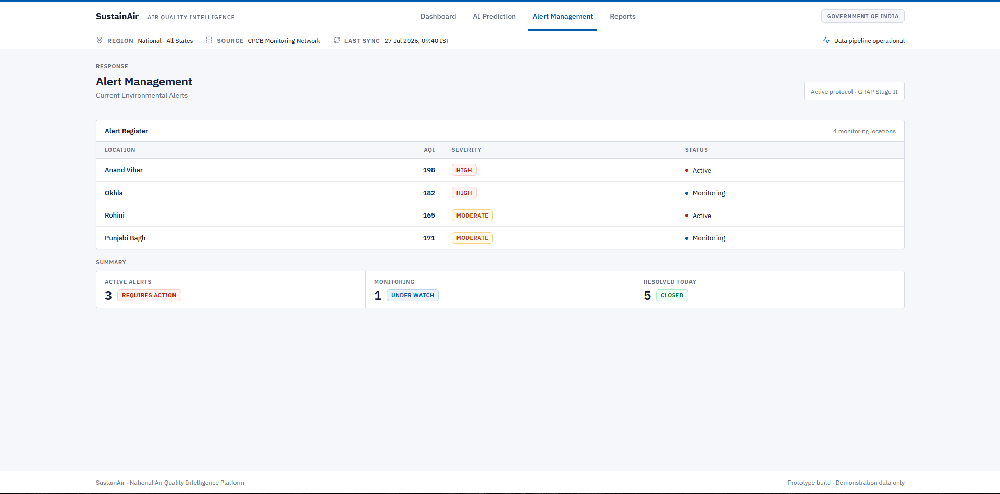
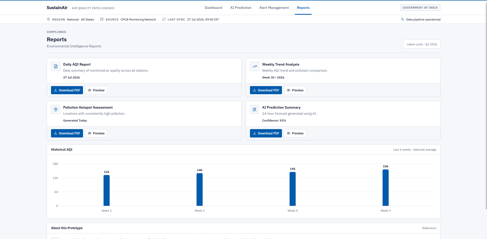
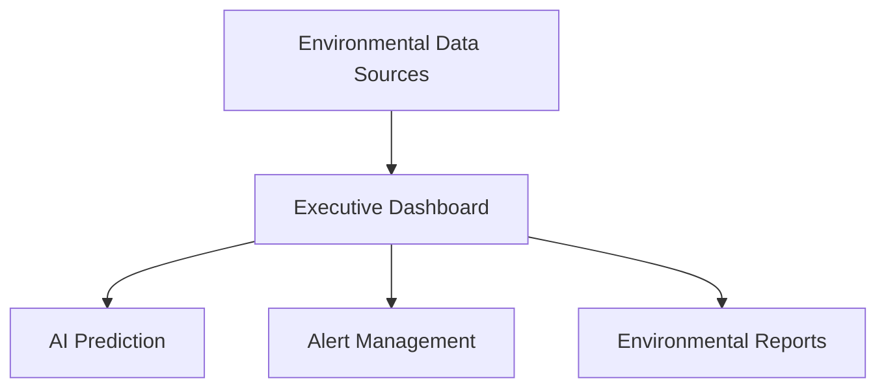

<div align="center">

# SustainAir

### AI-Enabled Smart Air Quality Monitoring & Response System

*An intelligent environmental monitoring dashboard demonstrating how AI can assist authorities with air quality forecasting, alert management, and environmental reporting.*

**Live Demo:** https://sustainair1m1b.vercel.app/

<p>


</p>

---

**SustainAir** is a modern frontend prototype showcasing how Artificial Intelligence can enhance environmental monitoring by assisting government agencies and environmental authorities with air quality visualization, pollution forecasting, environmental alerts, and intelligent reporting.

Developed as part of the **1M1B Innovation Challenge**, SustainAir demonstrates an enterprise-style dashboard experience using static mock data to showcase the concept of AI-assisted environmental intelligence.

</div>

---

# Table of Contents

- [Overview](#-overview)
- [Features](#-features)
- [Screenshots](#-screenshots)
- [Technology Stack](#-technology-stack)
- [System Overview](#-system-overview)
- [Project Structure](#-project-structure)
- [Getting Started](#-getting-started)
- [Deployment](#-deployment)
- [Project Milestones](#-project-milestones)
- [Future Enhancements](#-future-enhancements)
- [Contributing](#-contributing)
- [License](#-license)
- [Project Disclaimer](#-project-disclaimer)
- [Acknowledgements](#-acknowledgements)

---

# Overview

Air pollution continues to be one of the world's largest environmental challenges. SustainAir demonstrates how AI-powered decision support systems can help authorities monitor environmental conditions, forecast pollution trends, prioritize response actions, and improve public awareness.

The application focuses on presenting environmental intelligence through a clean, government-inspired interface featuring:

- Executive Air Quality Dashboard
- AI-Based AQI Forecast Visualization
- Environmental Alert Management
- Historical Reporting
- Decision Support Recommendations

The project is intentionally built as a **frontend-only prototype**, emphasizing user experience and dashboard design while using realistic mock data.

---

# Features

## Executive Dashboard

- Real-time AQI summary
- Air quality trend visualization
- Pollutant distribution chart
- Weather snapshot
- Active environmental alerts
- AI recommendations

---

## AI Prediction

- 24-hour AQI forecast
- Prediction confidence
- Environmental risk assessment
- AI-generated recommendations

---

## Alert Management

- Active pollution alerts
- Severity indicators
- Environmental incident overview
- Monitoring summary

---

## Reports

- Environmental intelligence reports
- Historical AQI visualization
- Pollution hotspot summaries
- Download-ready report cards

---

## Modern UI

- Government enterprise-inspired interface
- Fully responsive layout
- Interactive Recharts visualizations
- Clean, accessible design
- Built with reusable React components

---

# Screenshots

> Replace the placeholders below with screenshots after deployment.

## Executive Dashboard



---

## AI Prediction



---

## Alert Management



---

## Reports



---

# Technology Stack

## Frontend

- React
- Vite
- Tailwind CSS
- React Router
- Recharts
- Lucide React

---

## Design

- IBM Plex Sans
- Government Enterprise UI
- Responsive Layout
- Component-Based Architecture

---

## Deployment

- Vercel

---

# System Overview



---

# Project Structure

```text
SustainAir/
│
├── public/
│
├── src/
│   ├── components/
│   │   ├── alerts/
│   │   ├── charts/
│   │   ├── dashboard/
│   │   ├── prediction/
│   │   ├── reports/
│   │   └── ui/
│   │
│   ├── data/
│   │
│   ├── pages/
│   │
│   ├── App.jsx
│   └── main.jsx
│
├── docs/
│   └── images/
│
├── README.md
└── package.json
```

---

# Getting Started

## Prerequisites

- Node.js 20+
- npm

---

## Clone Repository

```bash
git clone https://github.com/abuhamjad/SustainAir.git

cd SustainAir
```

---

## Install Dependencies

```bash
npm install
```

---

## Start Development Server

```bash
npm run dev
```

Application runs at:

```
http://localhost:5173
```

---

## Production Build

```bash
npm run build
```

---

## Preview Production Build

```bash
npm run preview
```

---

# Deployment

SustainAir is deployed using **Vercel**.

To deploy your own instance:

```bash
git clone <repository>

npm install

npm run build
```

Import the repository into **Vercel** and deploy with the default Vite configuration.

---

# Project Milestones

## Phase 1 — Foundation

- Project initialization
- React + Vite setup
- Tailwind CSS integration
- Routing configuration

---

## Phase 2 — Dashboard Development

- Executive Dashboard
- AQI statistics
- Trend visualizations
- Pollutant analytics

---

## Phase 3 — Environmental Intelligence

- AI Prediction page
- Alert Management
- Reports dashboard
- Responsive interface

---

## Phase 4 — Production Release

- UI refinement
- Responsive optimization
- Reusable components
- Vercel deployment
- Complete documentation

---

# Future Enhancements

- Live AQI API integration
- Machine Learning forecasting models
- GIS-based pollution maps
- IoT sensor connectivity
- Real-time notifications
- Government authentication portal
- PDF report export
- Email alerts
- Historical analytics
- Multi-city monitoring

---

# Contributing

Contributions are welcome!

1. Fork the repository.
2. Create a feature branch.
3. Commit your changes.
4. Push your branch.
5. Open a Pull Request.

---

# License

This project is licensed under the MIT License.

See the `LICENSE` file for details.

---

# Project Disclaimer

SustainAir is a **frontend demonstration prototype** developed for the **1M1B Innovation Project**.

- All environmental information displayed uses **static mock data**.
- AI predictions and recommendations are **conceptual demonstrations** and are **not generated by a live AI model**.
- The project is intended to showcase user experience, dashboard design, and environmental monitoring concepts rather than production-ready forecasting.

---

<div align="center">

## If you found SustainAir interesting, consider giving this repository a star!

**Built for the 1M1B Innovation Challenge using React, Vite & Tailwind CSS.**

</div>